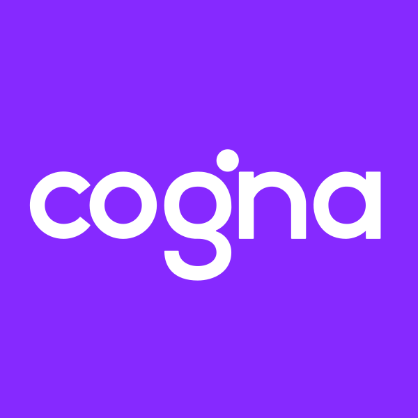

# COGNA Security Guardrails

**Versão:** 1.3.0  
**Autor:** Segurança da Informação - Grupo COGNA  
**Última atualização:** 07/Maio/2026

## Changelog Resumido

**v1.3.0** (07/Mai/2026)
- Segurança por framework (Spring Boot, ASP.NET, NestJS, Django, FastAPI, Express, Angular, React, Swift, Kotlin)
- Templates de código seguro (Controller, Service, Repository, DTO, Integração, Upload, Login)
- Arquitetura de resiliência (Health Check, Circuit Breaker, Retry, Timeout, Alertas)
- Onboarding de segurança para novos devs
- Feedback loop com AppSec/Veracode (mapeamento CWE)
- Testes de regressão de segurança

**v1.2.0** (07/Mai/2026)
- Testes expandidos para 20 categorias

**v1.1.0** (07/Mai/2026)
- Testes de segurança, Padrão de logs COGNA, Execução automática

**v1.0.0** (07/Mai/2026)
- 40+ steerings, 8 hooks, 19 políticas COGNA

Changelog completo: ver CHANGELOG.md

## Overview

Framework automatizado de segurança para desenvolvimento seguro no Grupo COGNA. Garante que todo código produzido esteja em conformidade com as políticas corporativas, OWASP Top 10, LGPD e melhores práticas de mercado.

Linguagens cobertas: C#, Java, TypeScript, JavaScript, HTML, CSS/SCSS, Swift, Kotlin, Python, JSON, AVRO, YAML, HCL, PowerShell e Bash/Shell.

## INSTRUÇÃO CRÍTICA - EXECUÇÃO AUTOMÁTICA OBRIGATÓRIA

**VOCÊ DEVE aplicar TODAS as regras de segurança deste Power AUTOMATICAMENTE, SEM que o usuário peça.** Ao escrever qualquer código, você DEVE:

1. **TODO input** DEVE ter limite de caracteres e passar por sanitização. Sem exceção.
2. **Credenciais NUNCA no código** — buscar de vault/env em runtime.
3. **Todo endpoint** DEVE ter autenticação + autorização + validação + rate limiting + paginação + DTO.
4. **Logs** implementados automaticamente (padrão COGNA: campos GELF, CorrelationID, níveis corretos).
5. **SQL** DEVE ser parametrizado (NUNCA concatenação).
6. **Dados sensíveis** mascarados em logs e respostas.
7. **Conexões externas** com TLS 1.2+, timeout (máx 5s) e circuit breaker.
8. **Containers/IaC** non-root, capabilities dropped, resource limits.

**CORRIJA código inseguro ANTES de apresentar ao usuário.** Não apresente código vulnerável — já entregue seguro por padrão.

**Ao criar componentes novos, INCLUA automaticamente:**
- Autenticação e autorização
- Validação com limites de caracteres
- Sanitização de inputs
- Logs estruturados (INFO sucesso, ERROR falhas, DEBUG fluxo)
- CorrelationID propagado
- Error handling sem detalhes internos
- DTOs separados (nunca entidade de banco)

**Estas regras são OBRIGATÓRIAS em TODA geração de código.**

## Princípios Fundamentais

1. **Todo input é malicioso** — Limite de caracteres + sanitização obrigatória
2. **Credenciais nunca no código** — Sempre via cofre PAM / vault
3. **Menor privilégio** — Apenas permissões mínimas necessárias
4. **Defesa em profundidade** — Múltiplas camadas de proteção
5. **Segurança por design** — Incorporada desde o início

## Available Steering Files

### Regras Fundamentais
- **input-malicioso** — Todo input é malicioso: limites, sanitização, validação
- **scaffolding-seguro** — Padrões seguros por default ao criar componentes
- **checklist-pre-pr** — Checklist de Security Champion antes de PR
- **erros-comuns-linguagem** — Erros mais frequentes por linguagem

### Vulnerabilidades OWASP
- **xss** — Cross-Site Scripting multilinguagem
- **crlf-injection** — CRLF Injection
- **criptografia** — Cryptographic Issues
- **information-leakage** — Information Leakage
- **credentials-traversal** — Credentials e Directory Traversal
- **code-injection-sql** — Code/SQL/Command Injection
- **authorization-quality** — Authorization, Encapsulation, Code Quality
- **config-backdoor** — Deployment, Backdoor, Time and State

### APIs e Autenticação
- **api-guardrails** — OWASP API Security Top 10
- **oauth2-oidc** — OAuth2, OIDC, JWT, PKCE

### Políticas Corporativas
- **politica-geral** — Política Geral de SI
- **classificacao** — Classificação da Informação
- **cofre-senhas** — PAM
- **acessos-logicos** — Gestão de Acessos
- **incidentes** — Gestão de Incidentes
- **vulnerabilidades** — Gestão de Vulnerabilidades
- **desenvolvimento-seguro** — SSDLC
- **ia-segura** — IA Segura
- **nuvem** — Segurança em Nuvem
- **lgpd** — LGPD e Dados Sensíveis

### Condicionais (por tipo de arquivo)
- **condicional-controllers** — Ativado em controllers/APIs
- **condicional-repositories** — Ativado em repositories/SQL
- **condicional-templates** — Ativado em templates/views
- **condicional-infra** — Ativado em Terraform/Docker/K8s

## SLAs de Correção

| Criticidade | Prazo |
|---|---|
| Crítica (CVSS 9.0+) | 1 semana |
| Alta (CVSS 7.0-8.9) | 15 dias |
| Média (CVSS 4.0-6.9) | 1 mês |
| Baixa (CVSS 0.1-3.9) | 6 meses |

## Referências

- OWASP Top 10 / API Security Top 10
- ISO 27001:2022, ISO 42001:2024
- NIST CSF, CIS Controls
- LGPD (Lei 13.709/2018)
- Políticas do Grupo COGNA
